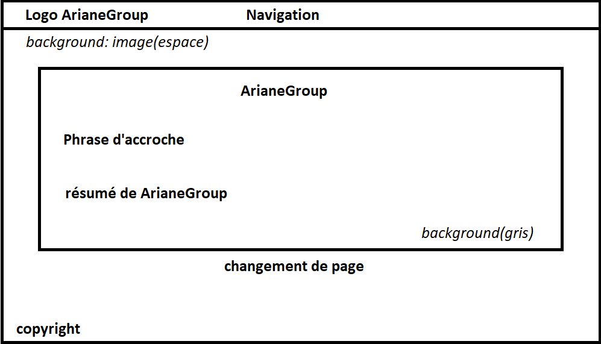
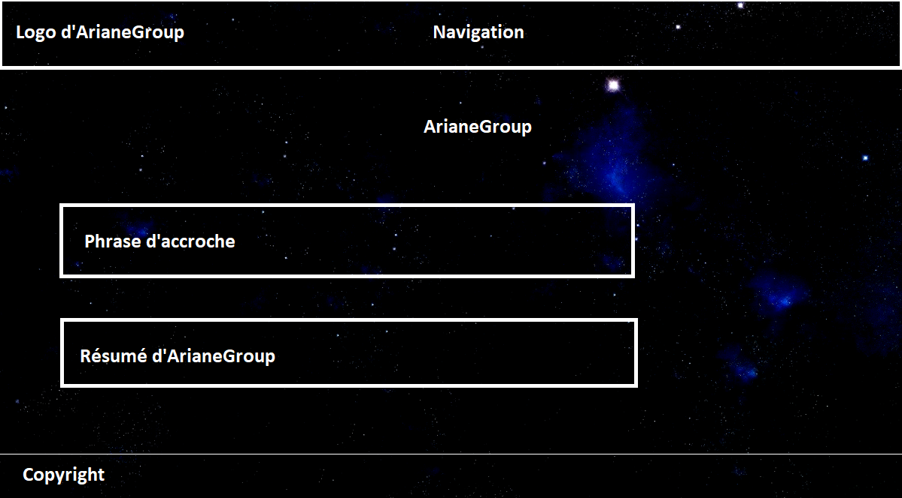

# ArianeGroup
## SAÉ 1.06

S1-C1

### GROUPE SAÉ :

Raphaël DANY

Téo DECONINCK

Simon NGUYEN

### Notre sujet :

On a choisi ArianeGroup car c'est une grande entreprise française qui évolue dans un domaine qui est très rare(l'espace)

### Répartition des tâches :

   La première page a été réalisée par Téo Deconinck, puis la seconde page a été faite par Raphaël Dany 
 et pour finir Simon Nguyen s'est chargé de la troisième page.
   
   La personne qui a créé l'écran de zoning est Téo Deconinck.

  Pour l'organisation pour la création du site internet, on s'est mis d'accord sur la charte graphique du site internet. Puis Raphaël s'est chargé de faire l'aspect graphique avec la page d'accueil et pour finir on a chacun de notre côté réalisé notre page
 

[Markdown Guide](Ariane6.png)

